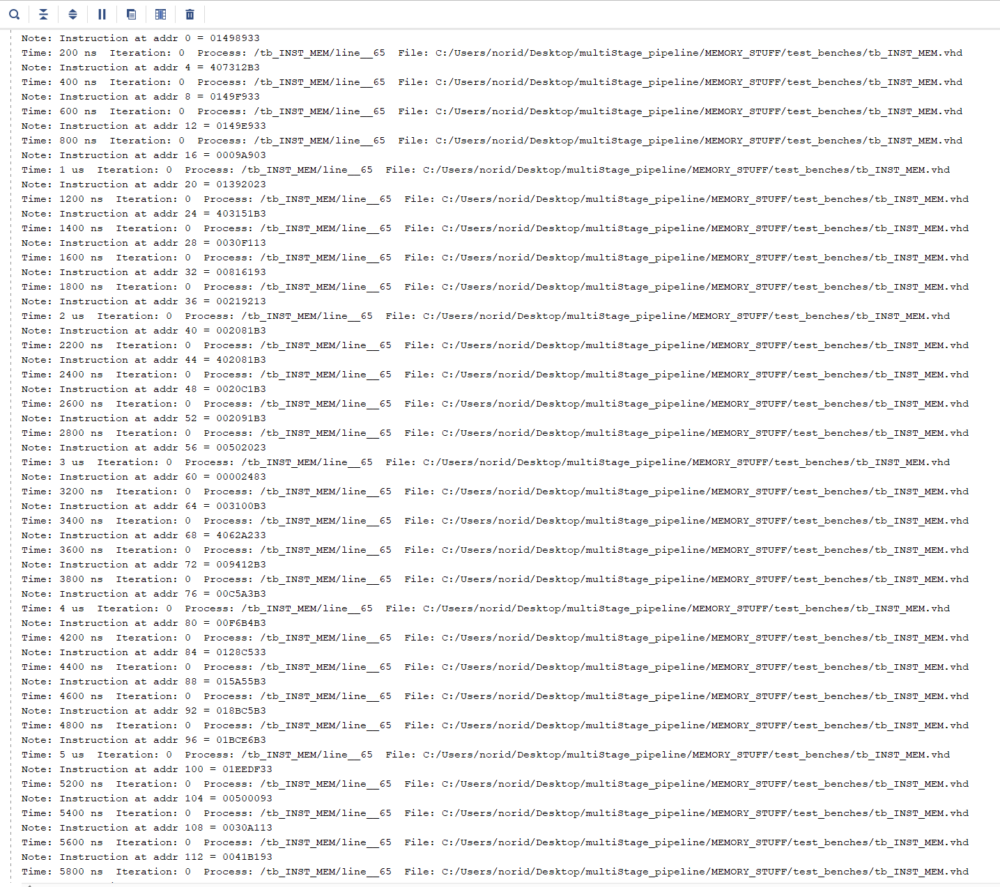
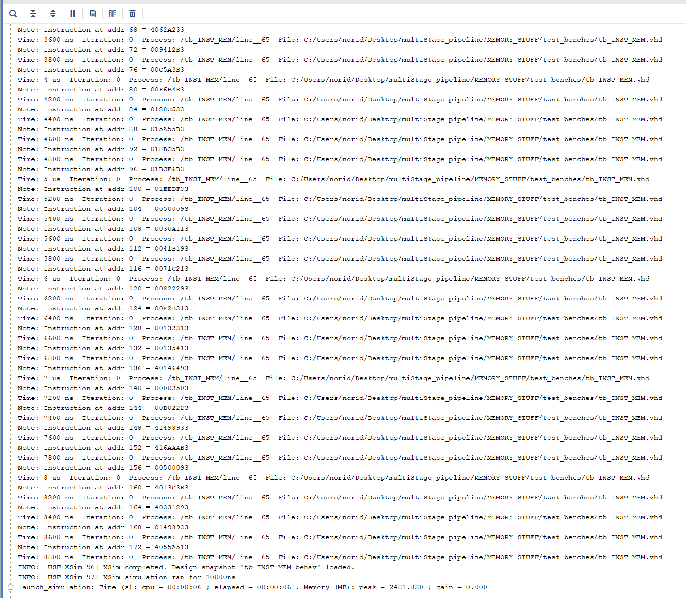
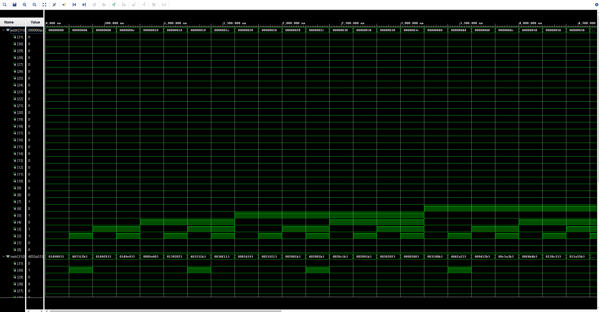
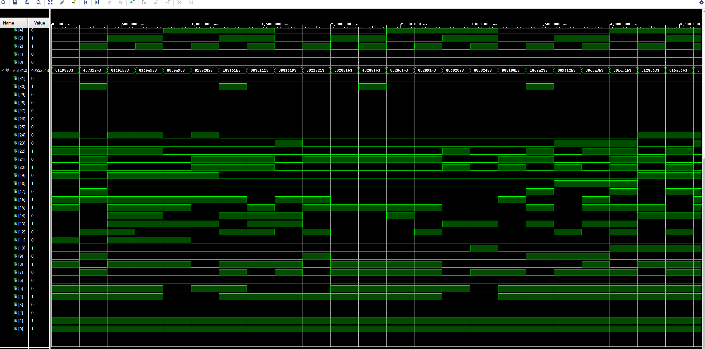

# MEMORY_MODULE

## Overview
This project implements a simple instruction memory module in VHDL, designed to serve the Instruction Fetch (IF) stage of a 5-stage pipelined RISC-V CPU. The INST_MEM module acts as a read-only memory (ROM) that outputs a 32-bit instruction based on a 32-bit byte address input. Address alignment is enforced on 4-byte boundaries.

## Features
- Read-only 32-bit instruction memory
- Byte-addressable interface with 4-byte alignment
- Indexed via address bits [9:2] (to support up to 256 instructions)
- Clean, lightweight architecture for simulation and early development

## Project Structure
MEMORY_MODULE/
├── images/
│   ├── tcl_tracktest.png
│   ├── tcl1.png
│   ├── tcl2.png
│   ├── wave1.png
│   ├── wave2.png
├── src/
│   ├── INST_MEM.vhd
├── test_benches/
│   ├── tb_INST_MEM.vhd
│   ├── tb_inst_memory.vhd
├── .gitignore/
├── README.md/

## Testbench Strategy
Two testbenches are provided:
- **tb_INST_MEM.vhd** — Compares each fetched instruction against a predefined instruction set.
- **tb_inst_memory.vhd** — Tracks pass/fail counts and prints mismatch reports showing the address, expected, and actual instruction.

## Key Learnings
- Understood that VHDL function behaves like pass-by-value (similar to C)
- Learned that procedure in VHDL behaves like pass-by-reference
- Applied array attributes ('range, 'length, etc.) for more general, reusable memory design
- Continued refining testbench output readability and result tracking

## Simulation Results
### Tcl Console Output
 
 
 

### Waveform Example
 
 

## How to Run

1. Launch **Vivado 2019** or newer
2. Open the project or create a new one and add the src and a test bench file.
3. Set one of the testbench files as the top-level simulation unit.
4. Run the simulation:
    - Go to Flow → Run Simulation → Run Behavioral Simulation
    - Or use the project manager's simulation shortcut.
5. View signals in the Waveform Viewer and test status in the Tcl Console.

## Author
**Noridel Herron** (@MIZZOU)  
Senior in Computer Engineering  
noridel.herron@gmail.com

## Contributing
This is a personal academic project. Suggestions, issues, and improvements are welcome through GitHub.

## License
MIT License

## Author
**Noridel Herron** (@MIZZOU)  
Senior in Computer Engineering  
noridel.herron@gmail.com

## Disclaimer
This project is developed solely for educational and personal learning purposes.  
It may contain unfinished or experimental features and is not intended for commercial or production use.

The above copyright notice and this permission notice shall be included in
all copies or substantial portions of the Software.

THE SOFTWARE IS PROVIDED "AS IS", WITHOUT WARRANTY OF ANY KIND, EXPRESS OR
IMPLIED, INCLUDING BUT NOT LIMITED TO THE WARRANTIES OF MERCHANTABILITY,
FITNESS FOR A PARTICULAR PURPOSE AND NONINFRINGEMENT. IN NO EVENT SHALL THE
AUTHORS OR COPYRIGHT HOLDERS BE LIABLE FOR ANY CLAIM, DAMAGES OR OTHER
LIABILITY, WHETHER IN AN ACTION OF CONTRACT, TORT OR OTHERWISE, ARISING FROM,
OUT OF OR IN CONNECTION WITH THE SOFTWARE OR THE USE OR OTHER DEALINGS IN
THE SOFTWARE.
